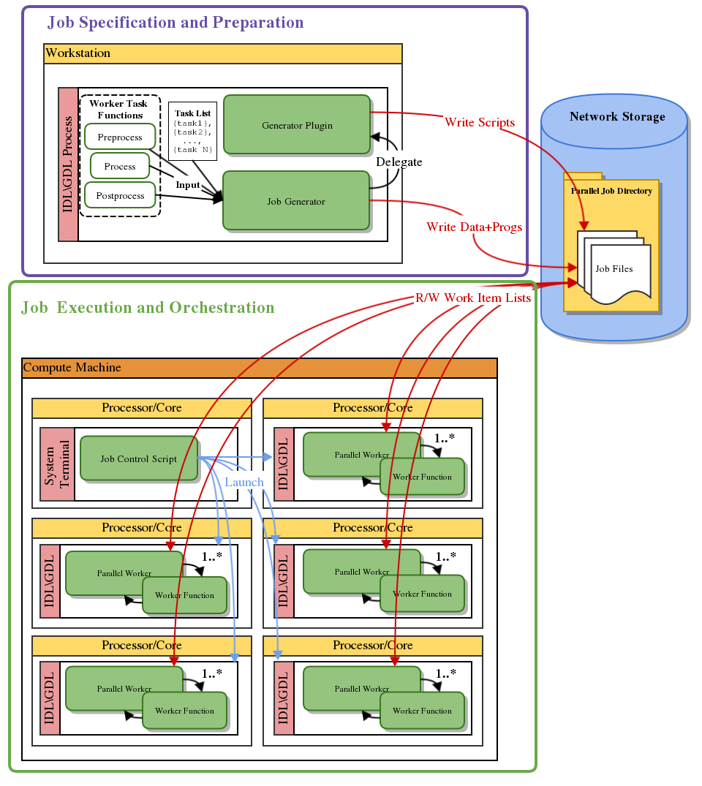
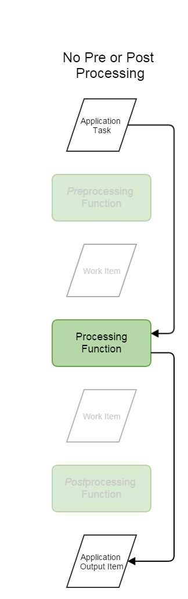
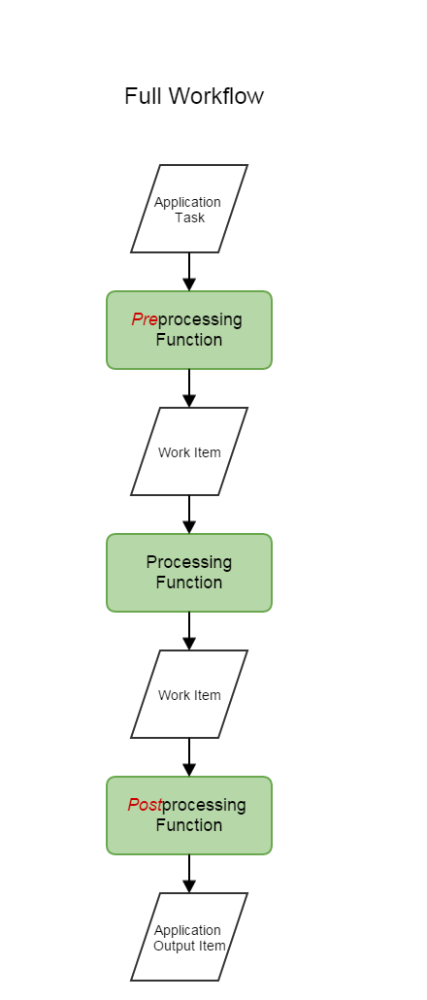
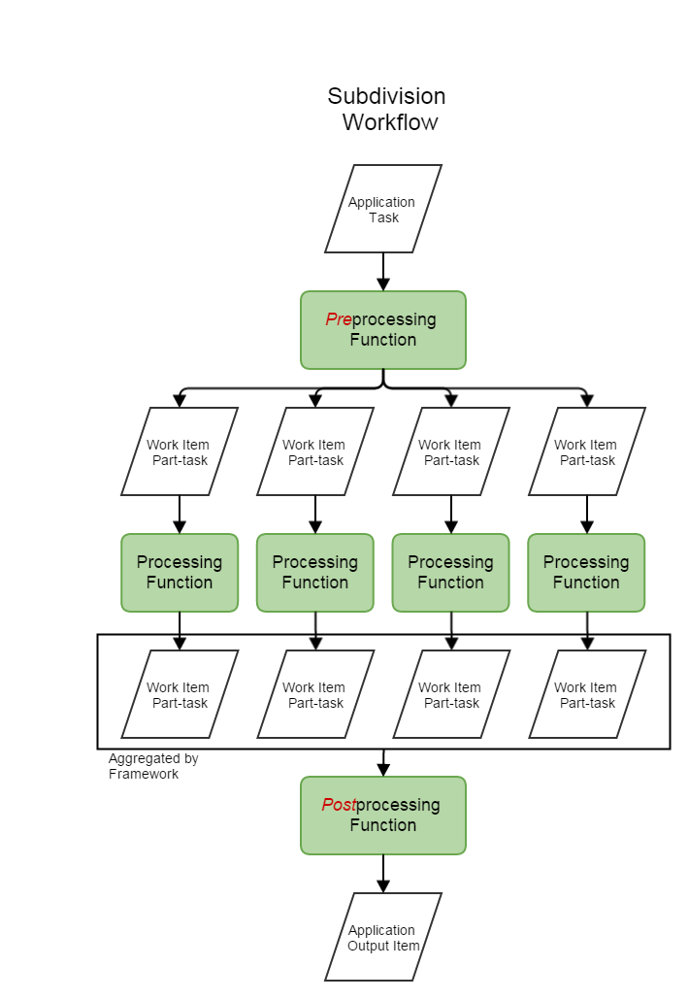

:Document Author: Luke Domanski, CSIRO, IM&T, Scientific Computing
:Document Format: This document was written in reStructuredText_. There a
                  numerous converters and generators for `exporting from
                  reStructuredText`_ to pretty document formats.

.. _reStructuredText: http://docutils.sourceforge.net/rst.html
.. _exporting from reStructuredText: http://docutils.sourceforge.net/docs/user/links.html#export

=========================
Concepts and Architecture
=========================

Important Framework Elements
============================
The important concepts or elements of the IDL Job Parallel Framework are:

- Application

  * Application Task

    + Application Task Structure

  * Worker Task Functions

    + Work Item
    + Preprocessing Function
    + Processing Function
    + Postprocessing Function

  * Task Subdivision

- Parallel Job

  * Application Task List
  * Parallel Worker
  * Parallel Job Directory

- Compute Machine

  * Parallel Platform
  * Job Execution

- Framework API

  * Job Generator
  * Job Generator Plugin

Element Definition and Interaction
==================================
Application
    Is an abstract concept within the Framework representing a complete program
    that produces some interesting result or output given some input. The
    application only materialises to an actual whole when the Framework
    constructs a *parallel job* that orchestrates the application execution.

    **Users** of the framework must programatically describe their
    *application* via its constituent parts and concepts.

    Application Task
        An independent unit of work passed into the *application* that produces
        a independent result

        Application Task Structure
            An IDL structure representing (holding) the input parameters for an
            *application task*

    Worker Task Functions
        A group of ordered functions that implement the application logic for a single
        *application task*.

        Work Item
            Units of work passed into and returned from *worker task
            functions*. A generalisation of *application task*, that represents
            the intermediate results or information forwarded between worker
            task functions. Input work items for one worker task function
            are output work items from the preceding function, if no preceding
            function exists it will be an application task.

        Preprocessing Function
            Optional preprocessing phase of application, it takes one
            *application task* as its input work item. It can produce multiple
            output work items based on specified *task subdivision*.

        Processing Function
            Mandatory processing phase of application, it takes one input *work
            item*, and produces one output work item regardless of *task
            subdivision*.

        Preprocessing Function
            Optional postprocessing phase of application, it can take a
            multi-part *work item* based on *task subdivsion*, and returns one
            output work item.

    Task Subdivision
        Individual *application tasks* can be subdivided in the preprocessing
        phase function for parallel processing by multiple processing phase
        functions based on a specified subdivision level *N*. Subsequently, the
        postprocessing phase must accept a work-item consisting of an *N* element
        array of partial work items.

Parallel Job
    A set of data, program, and scripts files orchestrating the execution of
    *application* logic on individual *applications tasks* specified in the
    *application task list*, via *parallel worker* processes calling
    appropriate *worker task functions*.  The parallel job processes multiple
    application tasks concurrently by launching concurrent parallel worker
    processes.

    Application Task List
        An IDL array of *application task structures* representing the tasks to
        be processed by a *parallel job*.

    Parallel Worker
        An IDL process that processes an array of *work items* given to it by
        the Framework, using a *worker task function* specified by the
        framework.

    Parallel Job Directory
        A directory containing all the files constituting a *parallel job*.

Compute Machine
    A computer or group of computers implementing a *parallel platform*, onto
    which the *parallel job directory* will be copied for *job execution*.

    Parallel Platform
        An operating system and software providing parallel computing
        capabilities and execution environment.

    Job Execution
        Launching the *parallel job* scripts on the *computer machine*.

Framework API
    The functions a user calls to generate a *parallel job*.

    Job Generator
        The component of the Framework that sets up the *parallel jobs
        directory* and creates job files.

        The **user** passes references to their application's *worker task
        functions*, along with an *application task list*, to the *job
        generator*.

    Job Generator Plugin
        An interchangeable component of the Framework that allows the *job
        generator* to create job files supporting a particular *parallel
        platform*.

        **Developers** can contribute new plugins to support new *parallel
        platforms*.

Framework Architecture
======================

The framework consists of two main components and APIs:

* Job specification and preparation: Where the user specifies the worker task
  functions that defined the application, which tasks to run, and information
  about the parallel resources desired.

* Job execution and orchestration: Which runs the previously specified worker
  task functions on the set of specified tasks under the chosen parallel
  configuration.

Job Specification and Preparation
~~~~~~~~~~~~~~~~~~~~~~~~~~~~~~~~~

This part of the framework allows a users to specify the job genertor plugin to
use for creating jobs, what worker tasks functions the application consists of,
and a list of applications tasks to run through the application.

It can be run on any workstation with IDL or GDL installed on it. Job generator
plugin discovery and selection are performed using the
`discover_generator_plugins`_ function and `load_generator_plugin`_ procedure.
Job specificaiton and generation is performed by calling the
`generate_parallel_job`_ procedure.

The `load_generator_plugin`_ procedure restores or compiles the specified
generator plugin, overwriting implementations of the internal genertor API
functions loaded for the previous (or default) plugin.

From a list of application tasks specified as an array of application task
structures, the `generate_parallel_job`_ procedure breaks the list up
appropriately for the desired number of parallel worker processes, and places
them into work item files suffixed with worker IDs and prefixed with a common
name, saved in the specified parallel job directory. Program files for
specified woker task functions are also copied to the job directory. It then
calls the generator functions of the loaded job generator plugin, that
generates scripts to run and coordinate parallel workers calling the specified
[pre|post]processing worker task functions on a particular parallel platform,
and which pass the appropriate work item files (based on worker ID) to the
parallel worker instances.

Job Execution and Orchestration
~~~~~~~~~~~~~~~~~~~~~~~~~~~~~~~

This part of the framework provides the API functions, procedures, and parallel
worker processes that are lauched by the generated job scripts on the compute
machine. The job scripts are largely responible for scheduling of parallel
resources, launching the parallel worker processes on them, and managing
execution order of dependant processing stages. The API processes and
procedures themselves ensure tasks and results are coordinated amoungst
parallel workers appropriately, and that the worker task functions are loaded and
called appropriately at the correct stages.

